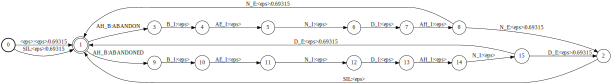

[](https://travis-ci.org/kaldi-asr/kaldi)

Liang's notes
================================

Tutorials
--------------------------

### Labs from Edinburgh
1. [Data Preparation and Feature Extraction](https://github.com/hotzhao/kaldi/blob/lz-voxforge/docs/lab1.pdf)
2. [Training monophone models](https://github.com/hotzhao/kaldi/blob/lz-voxforge/docs/lab2.pdf)
3. [Word recognition and triphone models](https://github.com/hotzhao/kaldi/blob/lz-voxforge/docs/lab3.pdf)
4. [Hybrid Acoustic Models](https://github.com/hotzhao/kaldi/blob/lz-voxforge/docs/lab4.pdf)

### Tricks
- Use Visual Studio Code on Ubuntu for debug (`kaldi/.vscode/launch.json`)
  - C++, Bash, Perl
- Ctrl+Shift+V for previewing README.md in Visual Studio Code
- cd kaldi/src/gmmbin && make gmm-init-mono

### Acronym
- `<eps>` epsilon, means no symbol here
- `OOV` out of vocabulary

Inspect
--------------------------

### `make_lexicon_fst.pl`

The command line looks like:
`make_lexicon_fst.pl --pron-probs /home/liang/work/speech/learnfst/input/lexiconp.txt 0.5 SIL > ./output/lexicon_fst.txt`
- silprob: 0.5
- silphone: "SIL"

The input `lexiconp.txt` looks like:
```
A 1.0 AH_S
A 1.0 EY_S
ABANDON 1.0 AH_B B_I AE_I N_I D_I AH_I N_E
ABANDONED 1.0 AH_B B_I AE_I N_I D_I AH_I N_I D_E
ABANDONMENT 1.0 AH_B B_I AE_I N_I D_I AH_I N_I M_I AH_I N_I T_E
...
```

Let's use a simpler input `lexiconp2.txt` for experiment:
```
ABANDON 1.0 AH_B B_I AE_I N_I D_I AH_I N_E
ABANDONED 1.0 AH_B B_I AE_I N_I D_I AH_I N_I D_E
```

The output `lexicon2_fst.txt` will be:
```
0	1	<eps>	<eps>	0.693147180559945
0	1	SIL	<eps>	0.693147180559945
2	1	SIL	<eps>
1	3	AH_B	ABANDON
3	4	B_I	<eps>
4	5	AE_I	<eps>
5	6	N_I	<eps>
6	7	D_I	<eps>
7	8	AH_I	<eps>
8	1	N_E	<eps>	0.693147180559945
8	2	N_E	<eps>	0.693147180559945
1	9	AH_B	ABANDONED
9	10	B_I	<eps>
10	11	AE_I	<eps>
11	12	N_I	<eps>
12	13	D_I	<eps>
13	14	AH_I	<eps>
14	15	N_I	<eps>
15	1	D_E	<eps>	0.693147180559945
15	2	D_E	<eps>	0.693147180559945
1	0
```

`fstcompile` will compile it into a binary version: 
`openfst-1.6.5/bin/fstcompile --isymbols=./symbols/phones.txt --osymbols=./symbols/words.txt --keep_isymbols=false --keep_osymbols=false ./output/lexicon2_fst.txt ./output/lexicon2.fst`

We can visualize it with command:
`openfst-1.6.5/bin/fstdraw --isymbols=../symbols/phones.txt --osymbols=../symbols/words.txt -portrait lexicon2.fst | dot -Tsvg > lexicon2.svg`




### FST details

Here is the fucking complicated class structure...
```c++
// A generic FST, templated on the arc definition, with common-demoninator
// methods (use StateIterator and ArcIterator to iterate over its states and
// arcs).
// just an interface, no member variable
template <class A>
class Fst {...};

// A generic FST plus state count.
template <class A>
class ExpandedFst : public Fst<A> {
  virtual StateId NumStates() const = 0;  // State count
}

// Abstract interface for an expanded FST which also supports mutation
// operations. To modify arcs, use MutableArcIterator.
template <class A>
class MutableFst : public ExpandedFst<A> {...}

// This is a helper class template useful for attaching an FST interface to
// its implementation, handling reference counting.
template <class Impl, class FST = Fst<typename Impl::Arc>>
class ImplToFst : public FST {...}

template <class Impl, class FST = ExpandedFst<typename Impl::Arc>>
class ImplToExpandedFst : public ImplToFst<Impl, FST> {...}

template <class Impl, class FST = MutableFst<typename Impl::Arc>>
class ImplToMutableFst : public ImplToExpandedFst<Impl, FST> {...}

// FST implementation base.
//
// This is the recommended FST implementation base class. It will handle
// reference counts, property bits, type information and symbols.
//
// Users are discouraged, but not prohibited, from subclassing this outside the
// FST library.
template <class Arc>
class FstImpl {
  mutable uint64 properties_;  // Property bits.
  string type_;  // Unique name of FST class.
  std::unique_ptr<SymbolTable> isymbols_;
  std::unique_ptr<SymbolTable> osymbols_;
};

// States are implemented by STL vectors, templated on the
// State definition. This does not manage the Fst properties.
template <class State>
class VectorFstBaseImpl : public FstImpl<typename S::Arc> {
  using StateId = typename State::Arc::StateId;
  std::vector<State *> states_;                 // States represenation.
  StateId start_;                               // Initial state.
}

// This is a VectorFstBaseImpl container that holds VectorStates and manages FST
// properties.
template <class S>
class VectorFstImpl : public VectorFstBaseImpl<S> {...}

template <class A, class S /* = VectorState<A> */>
VectorFst : public ImplToMutableFst<internal::VectorFstImpl<S>> {...}
```

```c++
// Arcs (of type A) implemented by an STL vector per state. M specifies Arc
// allocator (default declared in fst-decl.h).
template <class A, class M /* = std::allocator<A> */>
class VectorState {
  using Arc = A;
  using Weight = typename Arc::Weight;

  Weight final_;                       // Final weight.
  size_t niepsilons_;                  // # of input epsilons
  size_t noepsilons_;                  // # of output epsilons
  std::vector<A, ArcAllocator> arcs_;  // Arc container.
};
```

```c++
// We are using VectorFst<StdArc>

using StdArc = ArcTpl<TropicalWeight>;

template <class W>
struct ArcTpl {
 public:
  using Weight = W;
  using Label = int;
  using StateId = int;

  Label ilabel;
  Label olabel;
  Weight weight;
  StateId nextstate;
};

using TropicalWeight = TropicalWeightTpl<float>;

// Tropical semiring: (min, +, inf, 0).
template <class T>
class TropicalWeightTpl : public FloatWeightTpl<T> {...}

// Weight class to be templated on floating-points types.
template <class T = float>
class FloatWeightTpl {
  T value_;
};

static const TropicalWeightTpl<T> &Zero() {
  static const TropicalWeightTpl zero(Limits::PosInfinity());
  return zero;
}

// worth noting
static const TropicalWeightTpl<T> &One() {
  static const TropicalWeightTpl one(0.0F);
  return one;
}

static const TropicalWeightTpl<T> &NoWeight() {
  static const TropicalWeightTpl no_weight(Limits::NumberBad());
  return no_weight;
}
```

Fst properties:
  - kExpanded
  - kMutable
  - kError
  - kAcceptor // ilabel == olabel for each arc
  - kNotAcceptor // ilabel != olabel for some arc
  - kIDeterministic // ilabels unique leaving each state
  - kNonIDeterministic // ilabels not unique leaving some state
  - kODeterministic // olabels unique leaving each state
  - kNonODeterministic // olabels not unique leaving some state
  - kEpsilons // FST has input/output epsilons
  - kNoEpsilons // FST has no input/output epsilons
  - kIEpsilons
  - kNoIEpsilons
  - kOEpsilons
  - kNoOEpsilons
  - kILabelSorted // ilabels sorted wrt < for each state
  - kNotILabelSorted
  - kOLabelSorted
  - kNotOLabelSorted
  - kWeighted // Non-trivial arc or final weights.
  - kUnweighted
  - kCyclic
  - kAcyclic
  - kInitialCyclic // FST has cycles containing the initial state
  - kInitialAcyclic
  - kTopSorted // FST is topologically sorted
  - kNotTopSorted
  - kAccessible // All states reachable from the initial state
  - kNotAccessible
  - kCoAccessible // All states can reach a final state
  - kNotCoAccessible
  - kString
    - If NumStates() > 0, then state 0 is initial, state NumStates() - 1 is final, there is a transition from each non-final state i to state i + 1, and there are no other transitions.
  - kNotString // Not a string FST.
  - kWeightedCycles // FST has least one weighted cycle.
  - kUnweightedCycles // Only unweighted cycles.

Context fst:
```c++
// Actual FST for ContextFst.  Most of the work gets done in ContextFstImpl.
//
// A ContextFst is a transducer from symbols representing phones-in-context,
// to phones.  It is an on-demand FST.  However, it does not create itself in the usual
// way by expanding states by enumerating all their arcs.  This is possible to enable
// iterating over arcs, but it is not recommended.  Instead, we define a special
// Matcher class that knows how to request the specific arc corresponding to a particular
// output label.
//
// This class requires a list of all the phones and disambiguation
// symbols, plus the subsequential symbol.  This is required to be able to
// enumerate all output symbols (if we want to access it in an inefficient way), and
// also to distinguish between phones and disambiguation symbols.
template <class Arc,
          class LabelT = int32> // make the vector<LabelT> things actually vector<int32> for
                                // easier compatibility with Kaldi code.
class ContextFst : public ImplToFst<internal::ContextFstImpl<Arc, LabelT>> {
};

// ContextFstImpl inherits from CacheImpl, which handles caching of states.
template <class Arc,
          class LabelT = int32>
class ContextFstImpl : public CacheImpl<Arc> {
};

// A CacheBaseImpl with the default cache state type.
template <class Arc>
class CacheImpl : public CacheBaseImpl<CacheState<Arc>> {
};

// This class is used to cache FST elements stored in states of type State
// (see CacheState) with the flags used to indicate what has been cached. Use
// HasStart(), HasFinal(), and HasArcs() to determine if cached and SetStart(),
// SetFinal(), AddArc(), (or PushArc() and SetArcs()) to cache. Note that you
// must set the final weight even if the state is non-final to mark it as
// cached. The state storage method and any garbage collection policy are
// determined by the cache store. If the store is passed in with the options,
// CacheBaseImpl takes ownership.
template <class State,
          class CacheStore = DefaultCacheStore<typename State::Arc>>
class CacheBaseImpl : public FstImpl<typename State::Arc> {
};

// Cache state, with arcs stored in a per-state std::vector.
template <class A, class M = PoolAllocator<A>>
class CacheState {}

```

### HmmTopology
```
<Topology>
<TopologyEntry>
<ForPhones>
6 7 8 9 10 11 12 13 14 15 16 17 18 19 20 21 22 23 24 25 26 27 28 29 30 31 32 33 34 35 36 37 38 39 40 41 42 43 44 45 46 47 48 49 50 51 52 53 54 55 56 57 58 59 60 61 62 63 64 65 66 67 68 69 70 71 72 73 74 75 76 77 78 79 80 81 82 83 84 85 86 87 88 89 90 91 92 93 94 95 96 97 98 99 100 101 102 103 104 105 106 107 108 109 110 111 112 113 114 115 116 117 118 119 120 121 122 123 124 125 126 127 128 129 130 131 132 133 134 135 136 137 138 139 140 141 142 143 144 145 146 147 148 149 150 151 152 153 154 155 156 157 158 159 160 161
</ForPhones>
<State> 0 <PdfClass> 0 <Transition> 0 0.75 <Transition> 1 0.25 </State>
<State> 1 <PdfClass> 1 <Transition> 1 0.75 <Transition> 2 0.25 </State>
<State> 2 <PdfClass> 2 <Transition> 2 0.75 <Transition> 3 0.25 </State>
<State> 3 </State>
</TopologyEntry>
<TopologyEntry>
<ForPhones>
1 2 3 4 5
</ForPhones>
<State> 0 <PdfClass> 0 <Transition> 0 0.25 <Transition> 1 0.25 <Transition> 2 0.25 <Transition> 3 0.25 </State>
<State> 1 <PdfClass> 1 <Transition> 1 0.25 <Transition> 2 0.25 <Transition> 3 0.25 <Transition> 4 0.25 </State>
<State> 2 <PdfClass> 2 <Transition> 1 0.25 <Transition> 2 0.25 <Transition> 3 0.25 <Transition> 4 0.25 </State>
<State> 3 <PdfClass> 3 <Transition> 1 0.25 <Transition> 2 0.25 <Transition> 3 0.25 <Transition> 4 0.25 </State>
<State> 4 <PdfClass> 4 <Transition> 4 0.75 <Transition> 5 0.25 </State>
<State> 5 </State>
</TopologyEntry>
</Topology>
```

### `gmm-init-mono`

To get a summary of the information in the initial acoustic model:
```
$ gmm-info 0.mdl 
number of phones 161
number of pdfs 122
number of transition-ids 1026
number of transition-states 493
feature dimension 39
number of gaussians 122
```
- non-silence phones
  - phone number: 39
  - each phone has 4 versions (**B**egin, **E**nd, **I**nternal and **S**ingleton) depending on the position of the phone within a word
  - each phone-version has 3 HmmState (0, 1, 2)
- silence phones
  - phone number: 1
  - 5 phone-versions: SIL SIL_B SIL_E SIL_I SIL_S
  - each phone-version has 5 HmmState (0, 1, 2, 3, 5)
- number of phones
  - 161 = 39 * 4 + 1 * 5(phone-versions)
- number of pdfs / number of gaussians
  - 122 = 39 * 3 + 1 * 5(HmmState's)
  - `shared-phones=$lang/phones/sets.int`, each line contains a list of phones, whose pdfs should be shared. In the following case, all different versions of the original phone share the same pdf.
```
SIL SIL_B SIL_E SIL_I SIL_S
AA_B AA_E AA_I AA_S
AE_B AE_E AE_I AE_S
...
```

- transition-state : (phone, hmm-state, pdf) triple, in fact (phone, hmm-state) can uniquely specify the transition-state
  - number = 493 = (39 * 4) * 3 + (1 * 5) * 5
  - corresponds to an specific hmm-state, which has several transitions. (Please refer to the HmmTopology content above.)
- transition-id : (phone, hmm-state, transition-index)
  - number = 1026 = (39 * 4) * 3 * 2 + (1 * 5) * 4 * 4 + (1 * 5) * 1 * 2
  - start from 1
- transition-index : the index to the transitions in an hmm-state

We can inspect the monophone model (0.mdl) in text format with command:
```
$ gmm-copy --binary=false 0.mdl 0.mdl.txt
```
The content in 0.mdl.txt looks like:
```
<TransitionModel>
<Topology>
... identical to the content in HmmTopology above
</Topology>
<Triples> 493
1 0 0 
... all 493 triples (phone, hmm-state, pdf)
161 2 121 
</Triples>
<LogProbs>
[ 0 -1.386294 -1.386294 ... -0.2876821 ...] totally 1027 elements
the log probability of 1026 transitions (ps: -1.386294 = log0.25, -0.2876821 = log0.75)
</LogProbs>
</TransitionModel>
<DIMENSION> 39 <NUMPDFS> 122
<DiagGMM> x 122
<GCONSTS>  [ -86.05329 ]
<WEIGHTS>  [ 1 ]
<MEANS_INVVARS>  [
  0.002353243 0.004423528 0.003478537 -0.00244809 0.001304478 0.002062023 -0.005832749 -0.00332807 0.001774785 -0.002679929 0.00420974 0.0003790072 -0.008989353 0.001860187 0.0002457612 0.001255989 7.132275e-05 -0.0002768902 0.0003139818 0.000528892 0.00110333 0.0005636644 0.0009383564 -0.0008611914 -0.0004849995 -0.001642039 -0.001253331 -0.0011439 0.0008022264 -0.000681527 6.881662e-05 5.025769e-06 0.0003730553 0.0006924057 -0.0005075767 -0.000612477 -0.0006586588 -0.001523423 -2.454405e-05 ]
<INV_VARS>  [
  0.004328313 0.004157095 0.007124574 0.004427471 0.005096574 0.005316726 0.004573654 0.005058331 0.006678579 0.005767327 0.008642151 0.008125635 0.008972592 0.2198384 0.1083 0.1358945 0.1175475 0.1052888 0.09346534 0.08782058 0.09697565 0.09982689 0.09056854 0.1093345 0.119679 0.1415081 1.464113 0.743257 0.8086011 0.7720473 0.640147 0.5572934 0.5080652 0.5626333 0.5442337 0.5030745 0.5854164 0.6404312 0.763532 ]
</DiagGMM> 
...
```

- TransitionModel
  - topo_ : HmmTopology
  - tuples_ : std::vector<Tuple>, (phone, hmm-state, pdf) triples indexed by transition state minus one, the triples are in sorted order which allows us to do the reverse mapping from triple to transition state
  - state2id_ : std::vector<int32>, transition-state ==> the first transition-id of the transition-state
  - id2state_ : std::vector<int32>, transition-id ==> transition-state
  - id2pdf_id_ : transition-id ==> pdf
  - log_probs_ : Vector<BaseFloat>, the log probability of the 1026 transitions
  - non_self_loop_log_probs_ : For each transition-state, the log of (1 - self-loop-prob). Indexed by transition-state.

- gconst
  - The fxxking constant part in log[bj(Ot)]
  - bj(Ot) = the probability of feature vector 'Ot' generated by hmm-state j
  - the detailed inference
  - 

ContextDependency corresponds to the binary `voxforge/s5/exp/mono/tree` file

- ContextDependency is a generic decision tree.
  - N_ : context size, **context** is the context-window of phones, of length N. For monophone training, N = 1.
  - P_ : the central phone [position P] must be a real phone. For monophone training, P = 0.
  - to_pdf_ : EventMap*, should point to SplitEventMap
- SplitEventMap
  - key_ : EventKeyType, here it's always 0 (P_, position of central phone)
  - yes_set_ : ConstIntegerSet<EventValueType>, contains all the phones corresponds to yes_ child
  - yes_ : EventMap*, points to either SplitEventMap or TableEventMap
  - no_ : EventMap*
- TableEventMap
  - correspond to one phone set
  - the phones in one phone set share the same TopologyEntry
  - each TopologyEntry has several hmm-state's
  - each hmm-state correspond to a leaf
  - key_ : EventKeyType = kPdfClass == -1
  - table_ : std::vector<EventMap*>， pdf-class -> leaf-index, the EventMap* points to ConstantEventMap
- ConstantEventMap
  - answer_ : EventAnswerType, leaf-index

- EventKeyType(int): **have no idea right now**
- EventValueType(int): phone-version index, [1, 161]
- EventAnswerType(int): leaf index

### `sym2int.pl`

From the log, we can see, the whole command is:
```
sym2int.pl --map-oov 1 -f 2- /home/liang/work/speech/corpus/voxforge/selected/lang/words.txt < /home/liang/work/speech/corpus/voxforge/selected/train.1k/split6/1/text
```
- oov_sym = 1, `[--map-oov <oov-symbol>]`, 1 is the index of `!SIL`.
- -f 2-, `[-f <field-range> ]`, so field range is 2-, means we want to skip the first token, which is the utt-id.
- symtab = /home/liang/work/speech/corpus/voxforge/selected/lang/words.txt
- input transcriptions = /home/liang/work/speech/corpus/voxforge/selected/train.1k/split6/1/text
- take a peek of the first few lines of `words.txt`. It will confirm that oov_sym = 1
```
<eps> 0
!SIL 1
'EM 2
A 3
ABANDON 4
ABANDONED 5
...
```
- `text` looks like
```
Aaron-20080318-pwn-a0268 NOW GO AHEAD AND TELL ME IN A STRAIGHTFORWARD WAY WHAT HAS HAPPENED
Angus-20080320-cjg-a0159 THEY LOOK AS THOUGH HE HAD BEEN DRUMMING A PIANO ALL HIS LIFE
Anniepoo-20140308-byi-rb-29 THEREFORE BEHIND YOUR PC GO ONLINE START MY WEB BROWSER OR VISIT MY HOME PAGE
...
```
- the output looks like
```
Aaron-20080318-pwn-a0268 8238 5315 277 417 12320 7559 6220 3 11841 13530 13607 5655 5605
Angus-20080320-cjg-a0159 12447 7258 642 12495 5691 5552 1040 3736 3 8973 316 5842 7120
Anniepoo-20140308-byi-rb-29 12439 1062 13916 8772 5315 8388 11724 7990 13558 1464 8437 13357 7990 5886 8610
...
```

### `compile-train-graphs`
The command is:
```
compile-train-graphs --read-disambig-syms=/home/liang/work/speech/corpus/voxforge/selected/lang/phones/disambig.int exp/mono/tree exp/mono/0.mdl /home/liang/work/speech/corpus/voxforge/selected/lang/L.fst "ark:/home/liang/work/speech/learngmm/sym2int.1.out" "ark:/home/liang/work/speech/learngmm/compile-train-graphs.1.out"
```
- tree in: exp/mono/tree
- model in: exp/mono/0.mdl
- lexicon fst in: /home/liang/work/speech/corpus/voxforge/selected/lang/L.fst
- transcriptions in: /home/liang/work/speech/learngmm/sym2int.1.out
- graphs out: /home/liang/work/speech/learngmm/compile-train-graphs.1.out
- options:
  - batch_size: by default is 250, process 250 utterances at a time
  - read-disambig-syms: /home/liang/work/speech/corpus/voxforge/selected/lang/phones/disambig.int

TrainingGraphCompilerOptions
- transition_scale : float=1.0, scale of transition probabilities (excluding self-loops)
  - ? Change the default to 0.0 since we will generally add the transition probs in the alignment phase
- self_loop_scale : float=1.0, scale of self-loop vs. non-self-loop probability mass
- reorder : bool=true, reorder transition ids for greater decoding efficiency
- rm_eps : bool=false, remove [most] epsilons before minimization (only applicable if disambig symbols present)

TrainingGraphCompiler
- trans_model_ : const TransitionModel&
- ctx_dep_ : const ContextDependency &
- lex_fst_ : `fst::VectorFst<fst::StdArc>*`, lexicon fst, it will be sorted by olabel in the constructor
- disambig_syms_ : `std::vector<int32>`
- lex_cache_ : `fst::TableComposeCache<fst::Fst<fst::StdArc> >`
- opts_ : TrainingGraphCompilerOptions

This is the **core** functions:
```c++
bool TrainingGraphCompiler::CompileGraphsFromText(
    const std::vector<std::vector<int32> > &transcripts,
    std::vector<fst::VectorFst<fst::StdArc>*> *out_fsts) {
  using namespace fst;
  std::vector<const VectorFst<StdArc>* > word_fsts(transcripts.size());
  for (size_t i = 0; i < transcripts.size(); i++) {
    VectorFst<StdArc> *word_fst = new VectorFst<StdArc>();
    MakeLinearAcceptor(transcripts[i], word_fst);
    word_fsts[i] = word_fst;
  }    
  bool ans = CompileGraphs(word_fsts, out_fsts);
  for (size_t i = 0; i < transcripts.size(); i++)
    delete word_fsts[i];
  return ans;
}

template<class Arc, class I>
void MakeLinearAcceptor(const vector<I> &labels, MutableFst<Arc> *ofst) {
  // labels can be a vector like:
  //    8238 5315 277 417 12320 7559 6220 3 11841 13530 13607 5655 5605
  // We are composing the `word fst` here. The `word fst` is a string like fst.

  typedef typename Arc::StateId StateId;
  typedef typename Arc::Weight Weight;

  ofst->DeleteStates();
  StateId cur_state = ofst->AddState();
  ofst->SetStart(cur_state);
  for (size_t i = 0; i < labels.size(); i++) {
    StateId next_state = ofst->AddState();
    Arc arc(labels[i], labels[i], Weight::One(), next_state);
    ofst->AddArc(cur_state, arc);
    cur_state = next_state;
  }
  ofst->SetFinal(cur_state, Weight::One());
}
```


Kaldi Speech Recognition Toolkit
================================

To build the toolkit: see `./INSTALL`.  These instructions are valid for UNIX
systems including various flavors of Linux; Darwin; and Cygwin (has not been
tested on more "exotic" varieties of UNIX).  For Windows installation
instructions (excluding Cygwin), see `windows/INSTALL`.

To run the example system builds, see `egs/README.txt`

If you encounter problems (and you probably will), please do not hesitate to
contact the developers (see below). In addition to specific questions, please
let us know if there are specific aspects of the project that you feel could be
improved, that you find confusing, etc., and which missing features you most
wish it had.

Kaldi information channels
--------------------------

For HOT news about Kaldi see [the project site](http://kaldi-asr.org/).

[Documentation of Kaldi](http://kaldi-asr.org/doc/):
- Info about the project, description of techniques, tutorial for C++ coding.
- Doxygen reference of the C++ code.

[Kaldi forums and mailing lists](http://kaldi-asr.org/forums.html):

We have two different lists
- User list kaldi-help
- Developer list kaldi-developers:

To sign up to any of those mailing lists, go to
[http://kaldi-asr.org/forums.html](http://kaldi-asr.org/forums.html):


Development pattern for contributors
------------------------------------

1. [Create a personal fork](https://help.github.com/articles/fork-a-repo/)
   of the [main Kaldi repository](https://github.com/kaldi-asr/kaldi) in GitHub.
2. Make your changes in a named branch different from `master`, e.g. you create
   a branch `my-awesome-feature`.
3. [Generate a pull request](https://help.github.com/articles/creating-a-pull-request/)
   through the Web interface of GitHub.
4. As a general rule, please follow [Google C++ Style Guide](https://google.github.io/styleguide/cppguide.html).
   There are a [few exceptions in Kaldi](http://kaldi-asr.org/doc/style.html).
   You can use the [Google's cpplint.py](https://raw.githubusercontent.com/google/styleguide/gh-pages/cpplint/cpplint.py)
   to verify that your code is free of basic mistakes.

Platform specific notes
-----------------------

### PowerPC 64bits little-endian (ppc64le)

- Kaldi is expected to work out of the box in RHEL >= 7 and Ubuntu >= 16.04 with
  OpenBLAS, ATLAS, or CUDA.
- CUDA drivers for ppc64le can be found at [https://developer.nvidia.com/cuda-downloads](https://developer.nvidia.com/cuda-downloads).
- An [IBM Redbook](https://www.redbooks.ibm.com/abstracts/redp5169.html) is
  available as a guide to install and configure CUDA.

### Android

- Kaldi supports cross compiling for Android using Android NDK, clang++ and
  OpenBLAS.
- See [this blog post](http://jcsilva.github.io/2017/03/18/compile-kaldi-android/)
  for details.
