Liang's notes
================================

Tutorials
--------------------------

### Labs from Edinburgh
1. [Data Preparation and Feature Extraction](https://github.com/hotzhao/kaldi/blob/lz-voxforge/docs/lab1.pdf)
2. [Training monophone models](https://github.com/hotzhao/kaldi/blob/lz-voxforge/docs/lab2.pdf)
3. [Word recognition and triphone models](https://github.com/hotzhao/kaldi/blob/lz-voxforge/docs/lab3.pdf)
4. [Hybrid Acoustic Models](https://github.com/hotzhao/kaldi/blob/lz-voxforge/docs/lab4.pdf)

### Tricks
- Use Visual Studio Code on Ubuntu for debug (`kaldi/.vscode/launch.json`)
  - C++, Bash, Perl
- Ctrl+Shift+V for previewing README.md in Visual Studio Code
- cd kaldi/src/gmmbin && make gmm-init-mono

### Acronym
- `<eps>` epsilon, means no symbol here
- `OOV` out of vocabulary

Inspect
--------------------------

### `make_lexicon_fst.pl`

The command line looks like:
`make_lexicon_fst.pl --pron-probs /home/liang/work/speech/learnfst/input/lexiconp.txt 0.5 SIL > ./output/lexicon_fst.txt`
- silprob: 0.5
- silphone: "SIL"

The input `lexiconp.txt` looks like:
```
A 1.0 AH_S
A 1.0 EY_S
ABANDON 1.0 AH_B B_I AE_I N_I D_I AH_I N_E
ABANDONED 1.0 AH_B B_I AE_I N_I D_I AH_I N_I D_E
ABANDONMENT 1.0 AH_B B_I AE_I N_I D_I AH_I N_I M_I AH_I N_I T_E
...
```

Let's use a simpler input `lexiconp2.txt` for experiment:
```
ABANDON 1.0 AH_B B_I AE_I N_I D_I AH_I N_E
ABANDONED 1.0 AH_B B_I AE_I N_I D_I AH_I N_I D_E
```

The output `lexicon2_fst.txt` will be:
```
0	1	<eps>	<eps>	0.693147180559945
0	1	SIL	<eps>	0.693147180559945
2	1	SIL	<eps>
1	3	AH_B	ABANDON
3	4	B_I	<eps>
4	5	AE_I	<eps>
5	6	N_I	<eps>
6	7	D_I	<eps>
7	8	AH_I	<eps>
8	1	N_E	<eps>	0.693147180559945
8	2	N_E	<eps>	0.693147180559945
1	9	AH_B	ABANDONED
9	10	B_I	<eps>
10	11	AE_I	<eps>
11	12	N_I	<eps>
12	13	D_I	<eps>
13	14	AH_I	<eps>
14	15	N_I	<eps>
15	1	D_E	<eps>	0.693147180559945
15	2	D_E	<eps>	0.693147180559945
1	0
```

`fstcompile` will compile it into a binary version: 

`openfst-1.6.5/bin/fstcompile --isymbols=./symbols/phones.txt --osymbols=./symbols/words.txt --keep_isymbols=false --keep_osymbols=false ./output/lexicon2_fst.txt ./output/lexicon2.fst`

Please note:
- From the shell-level, the FST arc type can be specified to fstcompile with the --arc_type flag; `StdArc` is the default. 
- `StdArc` uses `TropicalWeight`
  - TropicalWeight::Zero() = +inf, which is -ln(0)
  - TropicalWeight::One() = 0, which is -ln(1)
- A transition with Weight::One() is, in essence, "free".
- The transitions in `lexicon2_fst.txt` with no probability specified, by default, will have probability TropicalWeight::One(), which is 0.
- Please refer to http://www.openfst.org/twiki/bin/view/FST/FstQuickTour for more detailed info.

`fstprint` can convert it back to text format:

`openfst-1.6.5/bin/fstprint --isymbols=./symbols/phones.txt --osymbols=./symbols/words.txt ./output/lexicon2.fst ./output/lexicon2_fst.o.txt`

We can visualize it with command:

`openfst-1.6.5/bin/fstdraw --isymbols=../symbols/phones.txt --osymbols=../symbols/words.txt -portrait lexicon2.fst | dot -Tsvg > lexicon2.svg`

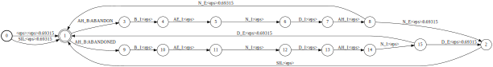

With `--show_weight_one` option added to `fstdraw`, we'll get 
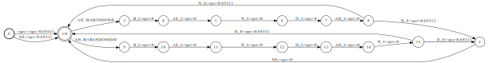

### HmmTopology
```
<Topology>
<TopologyEntry>
<ForPhones>
6 7 8 9 10 11 12 13 14 15 16 17 18 19 20 21 22 23 24 25 26 27 28 29 30 31 32 33 34 35 36 37 38 39 40 41 42 43 44 45 46 47 48 49 50 51 52 53 54 55 56 57 58 59 60 61 62 63 64 65 66 67 68 69 70 71 72 73 74 75 76 77 78 79 80 81 82 83 84 85 86 87 88 89 90 91 92 93 94 95 96 97 98 99 100 101 102 103 104 105 106 107 108 109 110 111 112 113 114 115 116 117 118 119 120 121 122 123 124 125 126 127 128 129 130 131 132 133 134 135 136 137 138 139 140 141 142 143 144 145 146 147 148 149 150 151 152 153 154 155 156 157 158 159 160 161
</ForPhones>
<State> 0 <PdfClass> 0 <Transition> 0 0.75 <Transition> 1 0.25 </State>
<State> 1 <PdfClass> 1 <Transition> 1 0.75 <Transition> 2 0.25 </State>
<State> 2 <PdfClass> 2 <Transition> 2 0.75 <Transition> 3 0.25 </State>
<State> 3 </State>
</TopologyEntry>
<TopologyEntry>
<ForPhones>
1 2 3 4 5
</ForPhones>
<State> 0 <PdfClass> 0 <Transition> 0 0.25 <Transition> 1 0.25 <Transition> 2 0.25 <Transition> 3 0.25 </State>
<State> 1 <PdfClass> 1 <Transition> 1 0.25 <Transition> 2 0.25 <Transition> 3 0.25 <Transition> 4 0.25 </State>
<State> 2 <PdfClass> 2 <Transition> 1 0.25 <Transition> 2 0.25 <Transition> 3 0.25 <Transition> 4 0.25 </State>
<State> 3 <PdfClass> 3 <Transition> 1 0.25 <Transition> 2 0.25 <Transition> 3 0.25 <Transition> 4 0.25 </State>
<State> 4 <PdfClass> 4 <Transition> 4 0.75 <Transition> 5 0.25 </State>
<State> 5 </State>
</TopologyEntry>
</Topology>
```

### `gmm-init-mono`

To get a summary of the information in the initial acoustic model:
```
$ gmm-info 0.mdl 
number of phones 161
number of pdfs 122
number of transition-ids 1026
number of transition-states 493
feature dimension 39
number of gaussians 122
```
- non-silence phones
  - phone number: 39
  - each phone has 4 versions (**B**egin, **E**nd, **I**nternal and **S**ingleton) depending on the position of the phone within a word
  - each phone-version has 3 HmmState (0, 1, 2)
- silence phones
  - phone number: 1
  - 5 phone-versions: SIL SIL_B SIL_E SIL_I SIL_S
  - each phone-version has 5 HmmState (0, 1, 2, 3, 5)
- number of phones
  - 161 = 39 * 4 + 1 * 5(phone-versions)
- number of pdfs / number of gaussians
  - 122 = 39 * 3 + 1 * 5(HmmState's)
  - `shared-phones=$lang/phones/sets.int`, each line contains a list of phones, whose pdfs should be shared. In the following case, all different versions of the original phone share the same pdf.
```
SIL SIL_B SIL_E SIL_I SIL_S
AA_B AA_E AA_I AA_S
AE_B AE_E AE_I AE_S
...
```

- transition-state : (phone, hmm-state, pdf) triple, in fact (phone, hmm-state) can uniquely specify the transition-state
  - number = 493 = (39 * 4) * 3 + (1 * 5) * 5
  - corresponds to an specific hmm-state, which has several transitions. (Please refer to the HmmTopology content above.)
- transition-id : (phone, hmm-state, transition-index)
  - number = 1026 = (39 * 4) * 3 * 2 + (1 * 5) * 4 * 4 + (1 * 5) * 1 * 2
  - start from 1
- transition-index : the index to the transitions in an hmm-state

We can inspect the monophone model (0.mdl) in text format with command:
```
$ gmm-copy --binary=false 0.mdl 0.mdl.txt
```
The content in 0.mdl.txt looks like:
```
<TransitionModel>
<Topology>
... identical to the content in HmmTopology above
</Topology>
<Triples> 493
1 0 0 
... all 493 triples (phone, hmm-state, pdf)
161 2 121 
</Triples>
<LogProbs>
[ 0 -1.386294 -1.386294 ... -0.2876821 ...] totally 1027 elements
the log probability of 1026 transitions (ps: -1.386294 = log0.25, -0.2876821 = log0.75)
</LogProbs>
</TransitionModel>
<DIMENSION> 39 <NUMPDFS> 122
<DiagGMM> x 122
<GCONSTS>  [ -86.05329 ]
<WEIGHTS>  [ 1 ]
<MEANS_INVVARS>  [
  0.002353243 0.004423528 0.003478537 -0.00244809 0.001304478 0.002062023 -0.005832749 -0.00332807 0.001774785 -0.002679929 0.00420974 0.0003790072 -0.008989353 0.001860187 0.0002457612 0.001255989 7.132275e-05 -0.0002768902 0.0003139818 0.000528892 0.00110333 0.0005636644 0.0009383564 -0.0008611914 -0.0004849995 -0.001642039 -0.001253331 -0.0011439 0.0008022264 -0.000681527 6.881662e-05 5.025769e-06 0.0003730553 0.0006924057 -0.0005075767 -0.000612477 -0.0006586588 -0.001523423 -2.454405e-05 ]
<INV_VARS>  [
  0.004328313 0.004157095 0.007124574 0.004427471 0.005096574 0.005316726 0.004573654 0.005058331 0.006678579 0.005767327 0.008642151 0.008125635 0.008972592 0.2198384 0.1083 0.1358945 0.1175475 0.1052888 0.09346534 0.08782058 0.09697565 0.09982689 0.09056854 0.1093345 0.119679 0.1415081 1.464113 0.743257 0.8086011 0.7720473 0.640147 0.5572934 0.5080652 0.5626333 0.5442337 0.5030745 0.5854164 0.6404312 0.763532 ]
</DiagGMM> 
...
```

- TransitionModel
  - topo_ : HmmTopology
  - tuples_ : std::vector<Tuple>, (phone, hmm-state, pdf) triples indexed by transition state minus one, the triples are in sorted order which allows us to do the reverse mapping from triple to transition state
  - state2id_ : std::vector<int32>, transition-state ==> the first transition-id of the transition-state
  - id2state_ : std::vector<int32>, transition-id ==> transition-state
  - id2pdf_id_ : transition-id ==> pdf
  - log_probs_ : Vector<BaseFloat>, the log probability of the 1026 transitions
  - non_self_loop_log_probs_ : For each transition-state, the log of (1 - self-loop-prob). Indexed by transition-state.

- gconst
  - The fxxking constant part in log[bj(Ot)]
  - bj(Ot) = the probability of feature vector 'Ot' generated by hmm-state j
  - the detailed inference
  - 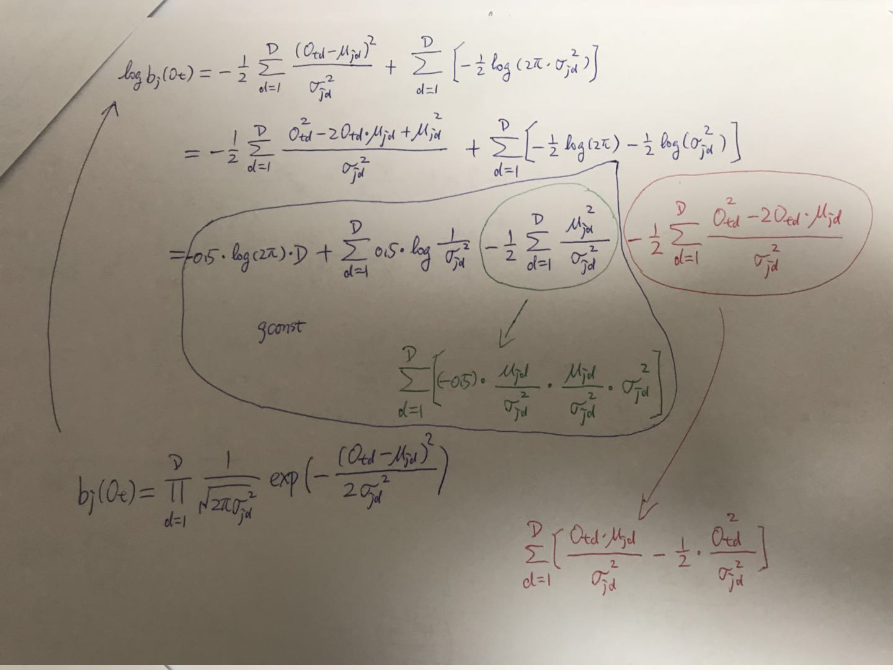

ContextDependency corresponds to the binary `voxforge/s5/exp/mono/tree` file

- ContextDependency is a generic decision tree.
  - N_ : context size, **context** is the context-window of phones, of length N. For monophone training, N = 1.
  - P_ : the central phone [position P] must be a real phone. For monophone training, P = 0.
  - to_pdf_ : EventMap*, should point to SplitEventMap
- SplitEventMap
  - key_ : EventKeyType, here it's always 0 (P_, position of central phone)
  - yes_set_ : ConstIntegerSet<EventValueType>, contains all the phones corresponds to yes_ child
  - yes_ : EventMap*, points to either SplitEventMap or TableEventMap
  - no_ : EventMap*
- TableEventMap
  - correspond to one phone set
  - the phones in one phone set share the same TopologyEntry
  - each TopologyEntry has several hmm-state's
  - each hmm-state correspond to a leaf
  - key_ : EventKeyType = kPdfClass == -1
  - table_ : std::vector<EventMap*>， pdf-class -> leaf-index, the EventMap* points to ConstantEventMap
- ConstantEventMap
  - answer_ : EventAnswerType, leaf-index

- EventKeyType(int): **have no idea right now**
- EventValueType(int): phone-version index, [1, 161]
- EventAnswerType(int): leaf index

### `sym2int.pl`

From the log, we can see, the whole command is:
```
sym2int.pl --map-oov 1 -f 2- /home/liang/work/speech/corpus/voxforge/selected/lang/words.txt < /home/liang/work/speech/corpus/voxforge/selected/train.1k/split6/1/text
```
- oov_sym = 1, `[--map-oov <oov-symbol>]`, 1 is the index of `!SIL`.
- -f 2-, `[-f <field-range> ]`, so field range is 2-, means we want to skip the first token, which is the utt-id.
- symtab = /home/liang/work/speech/corpus/voxforge/selected/lang/words.txt
- input transcriptions = /home/liang/work/speech/corpus/voxforge/selected/train.1k/split6/1/text
- take a peek of the first few lines of `words.txt`. It will confirm that oov_sym = 1
```
<eps> 0
!SIL 1
'EM 2
A 3
ABANDON 4
ABANDONED 5
...
```
- `text` looks like
```
Aaron-20080318-pwn-a0268 NOW GO AHEAD AND TELL ME IN A STRAIGHTFORWARD WAY WHAT HAS HAPPENED
Angus-20080320-cjg-a0159 THEY LOOK AS THOUGH HE HAD BEEN DRUMMING A PIANO ALL HIS LIFE
Anniepoo-20140308-byi-rb-29 THEREFORE BEHIND YOUR PC GO ONLINE START MY WEB BROWSER OR VISIT MY HOME PAGE
...
```
- the output looks like
```
Aaron-20080318-pwn-a0268 8238 5315 277 417 12320 7559 6220 3 11841 13530 13607 5655 5605
Angus-20080320-cjg-a0159 12447 7258 642 12495 5691 5552 1040 3736 3 8973 316 5842 7120
Anniepoo-20140308-byi-rb-29 12439 1062 13916 8772 5315 8388 11724 7990 13558 1464 8437 13357 7990 5886 8610
...
```

### `compile-train-graphs`
The command is:
```
compile-train-graphs --read-disambig-syms=/home/liang/work/speech/corpus/voxforge/selected/lang/phones/disambig.int exp/mono/tree exp/mono/0.mdl /home/liang/work/speech/corpus/voxforge/selected/lang/L.fst "ark:/home/liang/work/speech/learngmm/sym2int.1.out" "ark:/home/liang/work/speech/learngmm/compile-train-graphs.1.out"
```
- tree in: exp/mono/tree, ContextDependency
- model in: exp/mono/0.mdl, TransitionModel
- lexicon fst in: /home/liang/work/speech/corpus/voxforge/selected/lang/L.fst
- transcriptions in: /home/liang/work/speech/learngmm/sym2int.1.out
- graphs out: /home/liang/work/speech/learngmm/compile-train-graphs.1.out
- options:
  - batch_size: by default is 250, process 250 utterances at a time
  - read-disambig-syms: /home/liang/work/speech/corpus/voxforge/selected/lang/phones/disambig.int

For each utterance/sentence, it will generate an *transition-id-to-utterance fst*.
- FST's input: transition-id
- FST's output: the utterance
All the output FSTs will be archived into one file. The utterance-id will be used as the key to index these FSTs. In practice, the archived file will be gzip'ed.

Here we'll take the following utterance as an example to look into the detailed steps to generate the final FST.
`Dcoetzee-20110429-rmx-a0562 WHAT THE FLAMING`
After converting the words into integers, it will be:
`Dcoetzee-20110429-rmx-a0562 13607 12412 4745`

- 1, generate a *word-linear-acceptor fst*:
  - 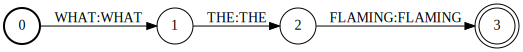

- 2, compose the *input lexicon fst* and the *word-linear-acceptor fst* to generate a *phone-to-utterance fst*
  - 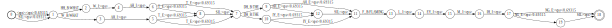

- 3, generate a kind of *context-to-phone fst*, please refer to ContextFst in `/kaldi/src/fstext/context-fst.h`
This is for phone-in-context. For monophone traning, the width of the context window is just one. Here the phone-in-context is essentially the phone.

- 4, compose the *context-to-phone fst* and the *phone-to-utterance fst* to generate a *context-to-utterance fst*
  - 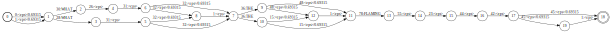

- 5, produce a kind of *transition-id-to-context fst* 
  - 5.1, for each phone, produce a small transition-id-to-phone fst
  - 5.2, here are 2 small ones for non-silent phones
    - 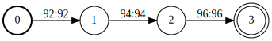
    - 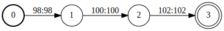
  - 5.3, here are 2 small ones for silent phones
    - 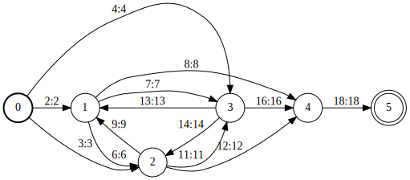
    - 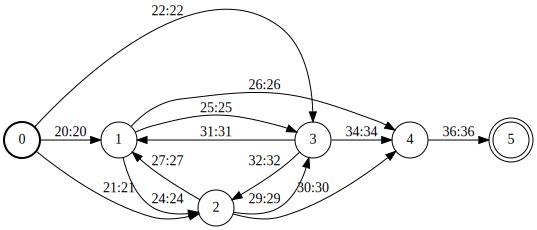
  - 5.4, all these small fst's will be combined together by MakeLoopFst(...) in `kaldi/src/fstext/fstext-utils-inl.h`. The following picture is just a combination of 4 phones. In practice, there will be more than 100 phones.
    - 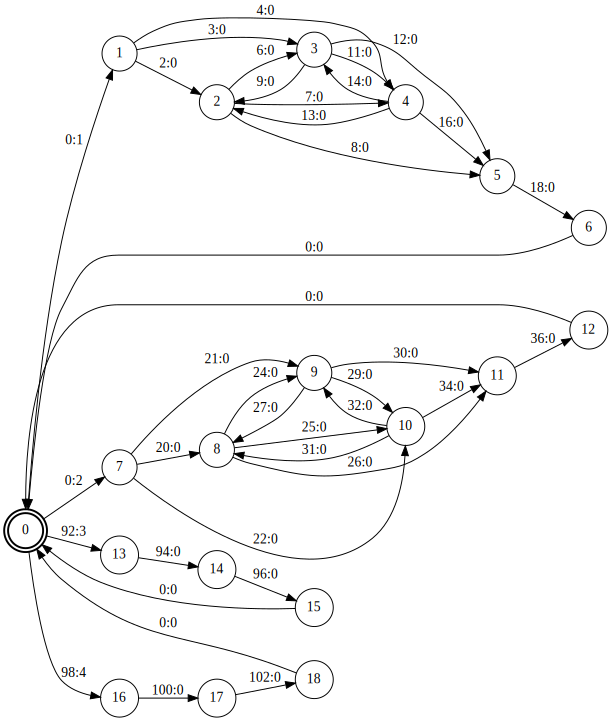

- 6, compose *transition-id-to-context fst* and *context-to-utterance fst*, to generate a *transition-id-to-utterance fst*
  - raw combination:
    - 
  - DeterminizeStarInLog:
    - 
  - MinimizeEncoded:
    - 
  - AddSelfLoops, we get the final result:
    - 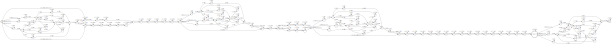

### `align-equal-compiled`

Given
- a transition-id-to-utterance fst
- the corresponding feature matrix
  - number of rows = frame_length
  - number of columns = 39 (feature dimension)

First, we choose a random path from the start state to the final state.

Here, each input label is a transition-id.

Each non-zero input label corresponds to one frame.

Along this random path, *num_ilabels* frames will be consumed.

So we still have *frame_length - num_ilabels* frames to consume.


